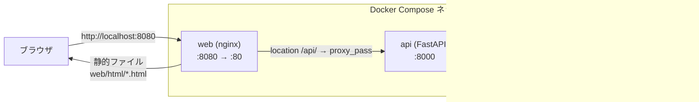
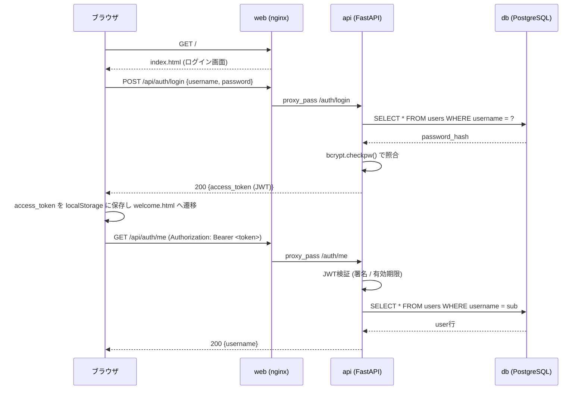

# ip3-hackathon

Docker Composeで構築したWeb / API / DBの3層構成。

## 構成

| サービス | 内容 |
|---|---|
| `web` | nginx。静的ファイル(`web/html`)を配信し、`/api/` を `api` サービスへリバースプロキシ |
| `api` | Python + [uv](https://docs.astral.sh/uv/) + FastAPI |
| `db` | PostgreSQL 16 |

## システム構成図



認証まわりの処理の流れ（ログイン → 保護ページ表示）:



## セットアップ

```bash
cp .env.example .env   # 必要に応じて値を編集
docker compose up -d --build
```

## エンドポイント

- Web: http://localhost:8080
  - `index.html` — ログイン画面
  - `welcome.html` — ログイン後の画面（`/auth/me` で認証チェック）
- API: http://localhost:8000
  - `GET /health`
  - `POST /auth/register`
  - `POST /auth/login`
  - `GET /auth/me`（要 `Authorization: Bearer <token>`）
  - `GET /items`
  - `POST /items`
- DB: localhost:5432

## ディレクトリ構成

```
.
├── docker-compose.yml
├── .env.example
├── api/            # FastAPI (uv管理)
│   ├── Dockerfile
│   ├── pyproject.toml
│   └── app/
│       ├── main.py
│       ├── auth.py     # パスワードハッシュ化 / JWT発行・検証
│       ├── config.py
│       ├── db.py
│       ├── models.py   # Item, User
│       └── schemas.py
└── web/            # nginx
    ├── Dockerfile
    ├── nginx.conf
    └── html/
        ├── index.html
        └── welcome.html
```

## 停止

```bash
docker compose down        # コンテナ停止(DBデータは保持)
docker compose down -v     # コンテナ停止 + DBデータ削除
```
