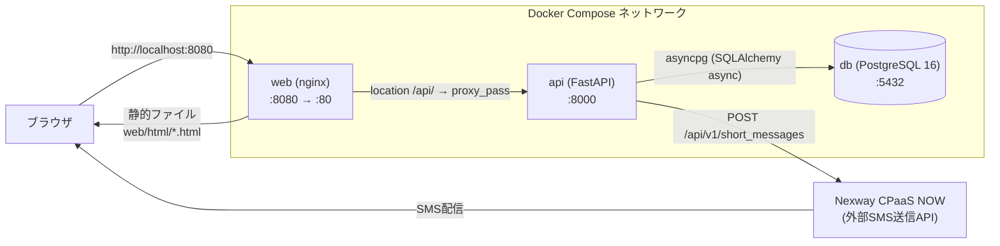
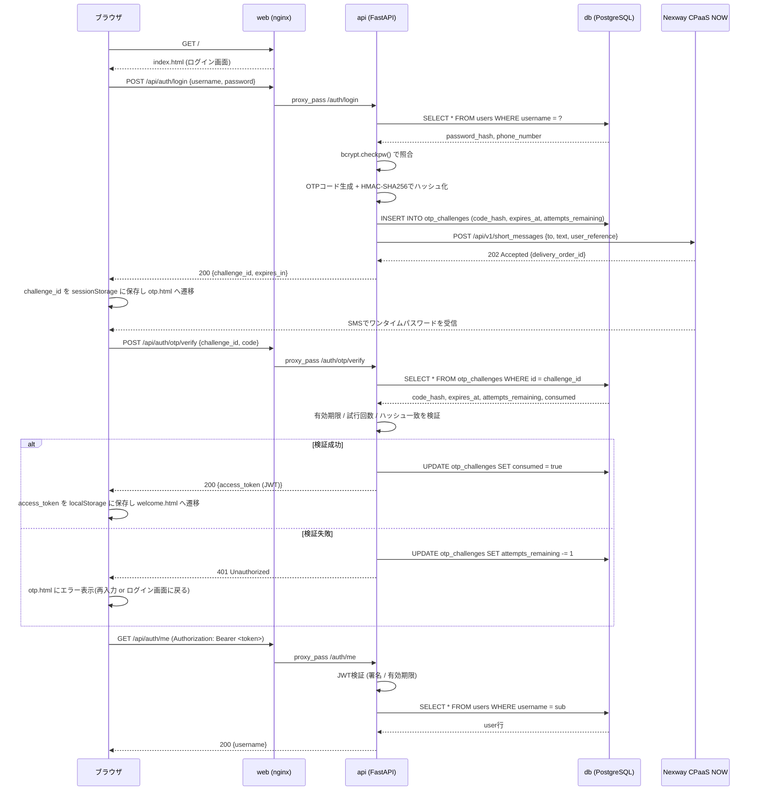

# ip3-hackathon

Docker Composeで構築したWeb / API / DBの3層構成。

## 構成

| サービス | 内容                                                                                 |
| -------- | ------------------------------------------------------------------------------------ |
| `web`    | nginx。静的ファイル(`web/html`)を配信し、`/api/` を `api` サービスへリバースプロキシ |
| `api`    | Python + [uv](https://docs.astral.sh/uv/) + FastAPI                                  |
| `db`     | PostgreSQL 16                                                                        |

## システム構成図



認証まわりの処理の流れ(ログイン → SMS OTP検証 → 保護ページ表示):



## セットアップ

```bash
cp .env.example .env   # 必要に応じて値を編集
docker compose up -d --build
```

## ログイン(SMS OTP)フロー

ID/パスワード認証に加えて、[Nexway CPaaS NOW](https://smslink.nexway.co.jp/service/api) を利用したSMSワンタイムパスワード(OTP)認証を実装しています。

1. `index.html` でログイン名・パスワードを送信(`POST /auth/login`)
2. サーバがID/PWを検証し、OTPコードを生成してCPaaS NOW経由でSMS送信。`challenge_id` を返す
3. `otp.html` でSMSに届いたコードを入力(`POST /auth/otp/verify`)
4. コードが正しければアクセストークンを発行し、`welcome.html` へ遷移

OTPコードはハッシュ化して保存し、有効期限(既定5分)・試行回数制限(既定5回)・使い捨て(検証成功後は再利用不可)を設けています。

CPaaS NOWのAPIホスト・APIトークンはハッシュソン当日に配布されるため、`.env` の以下の値を差し替えてください。

```
NEXWAY_API_BASE_URL=<配布されたホストURL>
NEXWAY_API_TOKEN=<配布されたAPIトークン>
```

開発環境のテスト用宛先(例: `09001111101` 〜 `09001111104` は `delivered`、`09001111201` 〜は `failed` を返す)が用意されているため、デモユーザーの電話番号は `09001111101` を初期値にしています。

### 接続情報が届く前のローカルテスト方法

CPaaS NOWの接続情報が届くまでは、`POST /api/v1/short_messages` を模したモックサーバーを立ててブラウザから通しでテストできます。

```bash
# 1. ローカルでモックSMSサーバーを起動(202 Acceptedを返し、送信内容を標準出力に表示)
python3 - <<'EOF' &
import json
from http.server import BaseHTTPRequestHandler, HTTPServer

class Handler(BaseHTTPRequestHandler):
    def do_POST(self):
        length = int(self.headers.get("Content-Length", 0))
        print("RECEIVED:", json.loads(self.rfile.read(length)), flush=True)
        self.send_response(202)
        self.send_header("Content-Type", "application/json")
        self.end_headers()
        self.wfile.write(json.dumps({"delivery_order_id": 1, "accepted_at": "2026-01-01T00:00:00Z"}).encode())
    def log_message(self, *args): pass

HTTPServer(("0.0.0.0", 9999), Handler).serve_forever()
EOF

# 2. .env のホストをモックに向ける
#    NEXWAY_API_BASE_URL=http://host.docker.internal:9999
docker compose up -d api

# 3. ブラウザで http://localhost:8080 からログイン
#    OTPコードはモックサーバーの標準出力(RECEIVED: ... "text": "ワンタイムパスワードは ****** です。")に表示される
```

ログインボタンを押すたびに新しいOTPチャレンジ・新しいコードが発行される点に注意してください(古いコードは無効)。接続情報が届いたら `NEXWAY_API_BASE_URL` / `NEXWAY_API_TOKEN` を本物の値に戻して `docker compose up -d api` してください。

## エンドポイント

- Web: http://localhost:8080
  - `index.html` — ログイン画面(ID/パスワード)
  - `otp.html` — ワンタイムパスワード入力画面
  - `welcome.html` — ログイン後の画面(ユーザー名表示・ログアウト)
- API: http://localhost:8000
  - `GET /health`
  - `POST /auth/register`(username, password, phone_number)
  - `POST /auth/login`(ID/PW検証 → OTP送信、`challenge_id` を返す)
  - `POST /auth/otp/verify`(OTP検証 → アクセストークン発行)
  - `GET /auth/me`(要 `Authorization: Bearer <token>`)
  - `GET /items`
  - `POST /items`
- DB: localhost:5432

デモ用アカウント: `demo` / `password`(電話番号 `09001111101`。API起動時に自動作成)

## ディレクトリ構成

```
.
├── docker-compose.yml
├── .env.example
├── api/            # FastAPI (uv管理)
│   ├── Dockerfile
│   ├── pyproject.toml
│   └── app/
│       ├── main.py
│       ├── auth.py       # パスワード/JWT/OTPハッシュ
│       ├── nexway.py     # CPaaS NOW SMS送信クライアント
│       ├── config.py
│       ├── db.py
│       ├── models.py   # Item, User
│       └── schemas.py
└── web/            # nginx
    ├── Dockerfile
    ├── nginx.conf
    └── html/
        ├── index.html    # ログイン画面(ID/パスワード)
        ├── otp.html      # OTP入力画面
        └── welcome.html  # ログイン後画面
```

## 停止

```bash
docker compose down        # コンテナ停止(DBデータは保持)
docker compose down -v     # コンテナ停止 + DBデータ削除
```
