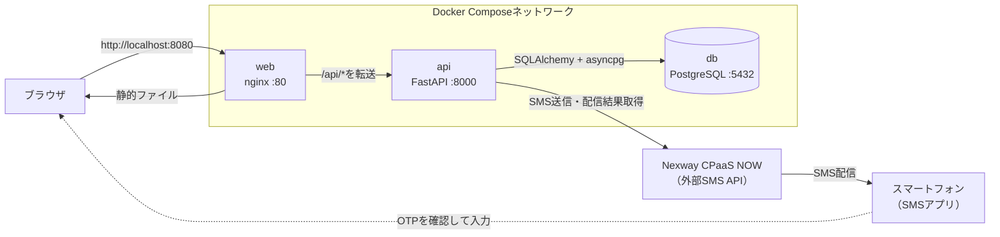
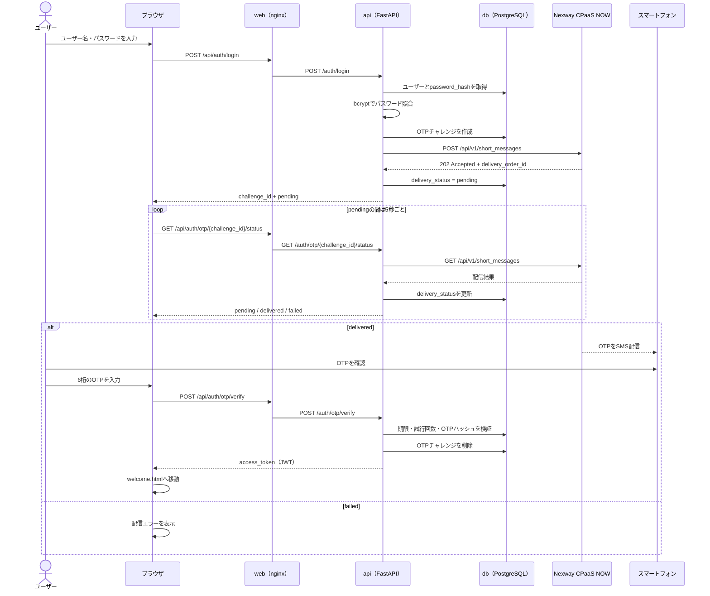

# ip3-hackathon

ID・パスワード認証にSMSワンタイムパスワード（OTP）を組み合わせた、Docker Composeで動く認証デモです。[Nexway CPaaS NOW](https://smslink.nexway.co.jp/service/api)へSMS送信を依頼し、アプリが配信結果を確認した後にOTP入力を受け付けます。

初めて動かす場合は「クイックスタート」と「検証環境で正常系と失敗系を試す」を順に読んでください。それ以降は必要な章だけ参照できます。

- [クイックスタート](#クイックスタート)
- [検証環境で正常系と失敗系を試す](#検証環境で正常系と失敗系を試す)
- [アーキテクチャ](#アーキテクチャ)
- [認証フロー](#認証フロー)
- [API](#api)
- [開発・デバッグ](#開発デバッグ)
- [トラブルシューティング](#トラブルシューティング)

## クイックスタート

### 前提

- Docker Desktopなど、Docker Composeを実行できる環境
- CPaaS NOW検証環境のエンドポイントとアクセストークン

### 1. 環境変数を用意する

```bash
cp .env.example .env
```

`.env`の次の項目を、配布された検証環境の値へ置き換えます。

```dotenv
NEXWAY_API_BASE_URL=https://sandbox.cpaasnow.com
NEXWAY_API_TOKEN=<配布されたアクセストークン>
```

アクセストークンは秘密情報です。`.env`はGitの管理対象に含めないでください。

### 2. コンテナを起動する

```bash
docker compose up -d --build
```

起動状態を確認します。

```bash
docker compose ps
curl http://localhost:8000/health
```

`db`が`healthy`、`api`と`web`が`Up`と表示され、ヘルスチェックが`{"status":"ok"}`を返せば起動完了です。

### 3. ブラウザからログインする

`http://localhost:8080`を開き、次のデモ用アカウントでログインします。

```text
ユーザー名: demo
パスワード: password
電話番号:   09001111101
```

デモ用アカウントは、DBに同名ユーザーが存在しない場合だけAPI起動時に作成されます。既存のDockerボリュームに別の`demo`ユーザーがある場合、そのパスワードや電話番号は更新されません。

ログイン後は、OTP画面が`pending`から`delivered`へ変わるまで待ちます。検証用番号では実端末に届かないことがあるため、開発中は「[OTPをAPIログで確認する](#otpをapiログで確認する)」の手順で6桁のコードを確認してください。コードを入力し、`welcome.html`でユーザー名が表示されれば正常系の確認は完了です。

### 4. コンテナを停止する

DBデータを残して停止します。

```bash
docker compose down
```

## アーキテクチャ



| サービス | 役割 |
| --- | --- |
| `web` | nginxで`web/html`の静的ファイルを配信し、`/api/`へのリクエストを`api`へ転送 |
| `api` | FastAPIでユーザー認証、OTPの発行・検証、JWTの発行、CPaaS NOWとの通信を処理 |
| `db` | PostgreSQLでユーザーとOTPチャレンジを永続化し、Dockerボリューム`db_data`に保存 |

ブラウザはPostgreSQLへ直接接続せず、必ずnginxとFastAPIを経由します。開発時にDBクライアントからデータを確認できるよう、Composeではホストの`5432`番ポートを公開しています。

## 認証フロー



### SMS配信状態

CPaaS NOWの`202 Accepted`は、SMSの配信完了ではなく、送信リクエストの受付完了を表します。FastAPIは受付時に`delivery_order_id`を保存します。その後、OTP画面は5秒ごとにFastAPIへ配信状態を問い合わせます。

| 状態 | 画面の動作 |
| --- | --- |
| `pending` | 配信結果を確認中。OTP入力欄は無効 |
| `delivered` | OTP入力欄を有効化 |
| `failed` | CPaaS NOWから取得した配信エラーを表示 |

ブラウザがCPaaS NOWを直接呼ぶことはありません。FastAPIのステータスAPIがCPaaS NOWの送信一覧を取得し、保存済みの`delivery_order_id`と一致する配信結果を探します。現在はページングやID指定による絞り込みを実装していないため、送信件数が増えると対象が一覧に含まれず、`pending`のままになる可能性があります。

FastAPIのOTP検証API自体は、配信状態を検証条件に含めません。ただし、現在のOTP画面は`delivered`になるまで入力欄を無効にします。

### OTPの制約

OTPは6桁、有効期限は5分、入力できる回数は5回です。残り試行回数は画面に表示しません。コードはHMAC-SHA256でハッシュ化して保存します。検証に成功したOTPチャレンジはDBから削除するため、再利用できません。

ログイン操作のたびに新しいOTPチャレンジが発行されます。以前に発行したチャレンジも、有効期限内かつ試行回数が残っていれば有効です。ブラウザは`sessionStorage`に保存した最新の`challenge_id`を使います。

## 検証環境で正常系と失敗系を試す

配布資料では検証用番号の先頭の`0`が省略されています。アプリへ登録するときは、先頭に`0`を補い、CPaaS NOW APIが要求する11桁の国内形式を指定してください。

| 期待する結果 | 電話番号 |
| --- | --- |
| `delivered` | `09001111101`〜`09001111104` |
| `failed` | `09001111201`〜`09001111204`、`09002222001` |

検証環境へ大量のリクエストを送らないでください。CPaaS NOW側の送信結果を管理画面で確認する必要がある場合は、アイピーキューブの社員に確認を依頼してください。問い合わせ時は`delivery_order_id`、`user_reference`、送信時刻、電話番号の末尾4桁を伝えます。アクセストークンやOTPは共有しないでください。

### 正常系

前提は、デモ用アカウント`demo / password`が`09001111101`を使用していることです。ログイン後、OTP画面が`pending`から`delivered`へ変わり、OTPを入力すると`welcome.html`へ移動することを確認します。

### 失敗系

失敗番号を持つユーザーは自動作成されません。次の例では`error-demo / password`を登録します。

```bash
curl -X POST http://localhost:8080/api/auth/register \
  -H "Content-Type: application/json" \
  -d '{"username":"error-demo","password":"password","phone_number":"09001111201"}'
```

登録後に`error-demo / password`でログインします。状態が`pending`から`failed`へ変わり、配信エラーの内容が表示されれば確認完了です。失敗確定まで1分以上かかる場合があります。

`error-demo`がすでに存在して`409 Conflict`になる場合は、登録を省略してログインするか、別のユーザー名を使用してください。

## 開発・デバッグ

### OTPをAPIログで確認する

検証環境で端末にSMSが届かない場合は、ローカルの`.env`で次を有効にします。

```dotenv
LOG_OTP_CODE=true
```

設定をコンテナへ反映し、ログを表示したままログインします。

```bash
docker compose up -d --force-recreate api
docker compose logs -f api
```

```text
開発用OTP: username=demo challenge_id=... code=123456
```

OTPは認証情報です。本番環境では必ず`LOG_OTP_CODE=false`にしてください。OTPが記録された既存ログも削除してください。

### CPaaS NOWへ接続できない場合はローカルモックを使う

接続情報がない段階でも、送信受付と`delivered`への状態遷移をローカルで確認できます。次の簡易モックは送信内容を標準出力に表示し、配信結果APIでは常に`delivered`を返します。パスや認証を厳密に検証しないため、CPaaS NOWとのAPI互換性テストには使えません。

この手順の`host.docker.internal`はDocker Desktopを前提とします。Linuxでは、Composeの`api`サービスへ`extra_hosts: ["host.docker.internal:host-gateway"]`を追加するなど、コンテナからホストへ接続できる設定が必要です。

<details>
<summary>ローカルモックのコードを表示</summary>

```bash
python3 - <<'PY' &
import json
from http.server import BaseHTTPRequestHandler, HTTPServer

DELIVERY_ORDER_ID = 1

class Handler(BaseHTTPRequestHandler):
    def send_json(self, status, body):
        data = json.dumps(body).encode()
        self.send_response(status)
        self.send_header("Content-Type", "application/json")
        self.send_header("Content-Length", str(len(data)))
        self.end_headers()
        self.wfile.write(data)

    def do_POST(self):
        length = int(self.headers.get("Content-Length", 0))
        payload = json.loads(self.rfile.read(length))
        print("RECEIVED:", payload, flush=True)
        self.send_json(202, {
            "delivery_order_id": DELIVERY_ORDER_ID,
            "accepted_at": "2026-01-01T00:00:00Z",
        })

    def do_GET(self):
        self.send_json(200, {
            "total": 1,
            "delivery_orders": [{
                "id": DELIVERY_ORDER_ID,
                "status": "completed",
                "user_reference": "local-mock",
                "deliveries": [{
                    "channel": "sms",
                    "status": "delivered",
                    "to": "09001111101",
                }],
            }],
        })

    def log_message(self, *args):
        pass

HTTPServer(("0.0.0.0", 9999), Handler).serve_forever()
PY
```

</details>

`.env`を次のように変更し、APIコンテナを再作成します。

```dotenv
NEXWAY_API_BASE_URL=http://host.docker.internal:9999
NEXWAY_API_TOKEN=local-mock
LOG_OTP_CODE=true
```

```bash
docker compose up -d --force-recreate api
```

確認が終わったら、モックを起動したシェルで`kill %1`を実行します。検証環境へ戻すときは`.env`の接続情報を元に戻し、同じコマンドでAPIコンテナを再作成してください。

### DBモデルを変更したら既存スキーマを確認する

`pyproject.toml`にはAlembicが含まれていますが、マイグレーション環境はまだ構成していません。API起動時の`Base.metadata.create_all()`は未作成のテーブルを作りますが、既存テーブルの列は変更しません。

モデル定義の変更によって既存DBとの不整合が生じた場合は、必要なデータを退避したうえでボリュームを作り直します。

```bash
docker compose down -v
docker compose up -d --build
```

`docker compose down -v`はDBデータを削除します。

## API

FastAPIの対話型ドキュメントは`http://localhost:8000/docs`で確認できます。

| メソッド | パス | 認証 | 用途 |
| --- | --- | --- | --- |
| `GET` | `/health` | 不要 | ヘルスチェック |
| `POST` | `/auth/register` | 不要 | ユーザー登録 |
| `POST` | `/auth/login` | 不要 | ID・パスワード検証、OTP送信受付 |
| `GET` | `/auth/otp/{challenge_id}/status` | 不要 | SMS配信結果の取得とDBへの反映 |
| `POST` | `/auth/otp/verify` | 不要 | OTP検証とアクセストークン発行 |
| `GET` | `/auth/me` | Bearer JWT | ログイン中のユーザーを取得 |
| `GET` | `/items` | 不要 | アイテム一覧を取得 |
| `POST` | `/items` | 不要 | アイテムを作成 |

ブラウザからはnginx経由の`/api/...`を使います。FastAPIへ直接アクセスする場合は、先頭の`/api`を付けません。

主要なレスポンスは次の形です。

```jsonc
// POST /auth/login
{"challenge_id":"...","expires_in":300,"delivery_status":"pending"}

// GET /auth/otp/{challenge_id}/status
{"delivery_status":"delivered","message":"SMSを配信しました。届いたコードを入力してください"}

// POST /auth/otp/verify
{"access_token":"...","token_type":"bearer"}
```

アクセストークンの有効期限は既定で60分です。認証エラーは`401`、存在しないOTPチャレンジは`404`、ユーザー名の重複は`409`、CPaaS NOWへの送信受付に失敗した場合は`502`を返します。入力スキーマや全レスポンスはOpenAPI画面で確認してください。

## 技術スタック

| 分類 | 技術・ライブラリ | 用途 |
| --- | --- | --- |
| フロントエンド | HTML / CSS / JavaScript | ログイン、配信状況確認、OTP入力、認証後画面 |
| Webサーバー | nginx 1.27 | 静的ファイル配信とAPIへのリバースプロキシ |
| API | Python 3.12 / FastAPI / Uvicorn | REST APIと非同期処理 |
| データアクセス | SQLAlchemy 2 / asyncpg | PostgreSQLへの非同期アクセスとORM |
| 設定・スキーマ | Pydantic Settings / Pydantic | 環境変数とAPI入出力の検証 |
| パスワード | bcrypt | パスワードのハッシュ化と照合 |
| OTP | `secrets` / `hmac` / `hashlib` | OTP生成とHMAC-SHA256ハッシュ |
| トークン | PyJWT | HS256署名のJWTを発行・検証 |
| HTTPクライアント | HTTPX | CPaaS NOWの送信APIと配信結果APIを非同期で呼び出す |
| データベース | PostgreSQL 16 | ユーザーとOTPチャレンジを永続化 |
| 実行環境 | Docker / Docker Compose / uv | コンテナ実行とPython依存関係の管理 |

このリポジトリには`uv.lock`がないため、Dockerイメージのビルド時に`pyproject.toml`のバージョン範囲から依存関係を解決します。同じソースでもビルド時期によって依存パッケージが変わる可能性があります。

## ディレクトリ構成

```text
.
├── .env.example
├── docker-compose.yml
├── api/
│   ├── Dockerfile
│   ├── pyproject.toml
│   └── app/
│       ├── auth.py       # パスワード、OTPハッシュ、JWT
│       ├── config.py     # 環境変数
│       ├── db.py         # SQLAlchemyの接続とセッション
│       ├── main.py       # FastAPIエンドポイント
│       ├── models.py     # User、OtpChallenge、Item
│       ├── nexway.py     # SMS送信と配信結果取得
│       └── schemas.py    # APIの入出力スキーマ
└── web/
    ├── Dockerfile
    ├── nginx.conf
    └── html/
        ├── index.html
        ├── otp.html
        └── welcome.html
```

## セキュリティ上の前提

この構成は、ローカル開発とハッカソンでのデモを想定しています。本番へ展開する場合は、少なくとも次の対応が必要です。

- `SECRET_KEY`に十分長いランダム値を設定し、シークレット管理基盤で安全に保管する
- PostgreSQLの既定ユーザー名・パスワードを変更する
- `LOG_OTP_CODE=false`にする
- ハードコードされた`demo / password`の自動作成を削除する
- PostgreSQLとFastAPIのホスト向けポート公開をやめる
- CORSの許可元を限定する
- 公開ユーザー登録を無効化するか、管理者だけに許可する
- `/items`を削除するか、必要な認可を追加する
- ログイン、OTP送信、OTP検証、配信状態確認へレート制限を追加する
- ユーザー名、パスワード、電話番号の入力制約を追加する
- JWTを`localStorage`へ保存する方式を見直し、XSS対策を強化する
- HTTPSを有効にする
- OpenAPI画面の公開範囲を制限する
- AlembicなどでDBマイグレーションを管理する
- 期限切れ・試行回数切れのOTPチャレンジを定期削除する

## トラブルシューティング

### ログイン時に500エラーになる

APIログを確認します。

```bash
docker compose logs --tail=100 api
```

モデル変更後から発生した場合は、既存DBのスキーマが古い可能性があります。「[DBモデルを変更したら既存スキーマを確認する](#dbモデルを変更したら既存スキーマを確認する)」を参照してください。

### `demo / password`でログインできない

デモ用ユーザーは、DBに`demo`が存在しない場合だけ自動作成されます。以前のデータが残っている場合は、別の登録済みユーザーを使うか、必要なデータを退避してから「[DBモデルを変更したら既存スキーマを確認する](#dbモデルを変更したら既存スキーマを確認する)」の手順でDBを作り直してください。

### SMS送信に失敗する

- `.env`の`NEXWAY_API_BASE_URL`と`NEXWAY_API_TOKEN`を確認する
- 電話番号が`070`、`080`、`090`などから始まる11桁になっているか確認する
- `user_reference`が40文字以内か確認する（現在は`ip1-{ユーザー名}`を40文字以内に切り詰めて送信）

### `pending`から変わらない

- CPaaS NOWの配信結果確定まで待つ。失敗系は1分以上かかる場合がある
- APIログに配信結果取得エラーがないか確認する
- ローカルモックを使っている場合は、モックが`GET /api/v1/short_messages`へ200を返すか確認する

### OTPが端末に届かない

`delivery_status`が`delivered`でも端末で確認できない場合は、CPaaS NOW側の送信結果についてアイピーキューブの社員に確認を依頼してください。開発中のOTP確認方法は「[OTPをAPIログで確認する](#otpをapiログで確認する)」を参照してください。

## 用語

| 用語 | 意味 |
| --- | --- |
| OTP | 1回限りの認証に使うワンタイムパスワード |
| JWT | 認証済みユーザーを示す署名付きトークン |
| `challenge_id` | OTPの発行単位を識別するUUID |
| `delivery_order_id` | CPaaS NOWがSMS送信受付時に発行するID |
| `delivery_status` | SMS配信状態。`pending`、`delivered`、`failed`のいずれか |

最終更新: 2026-07-24
